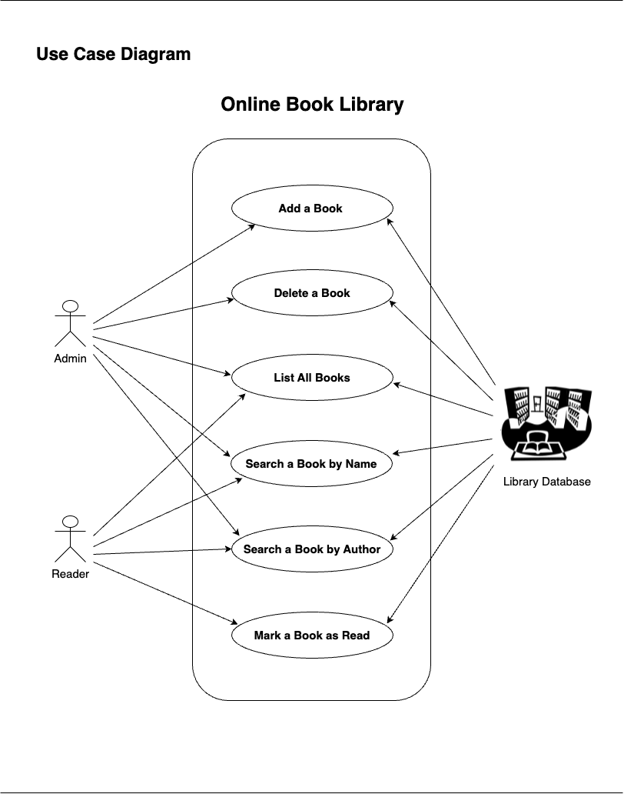

## ChalaniDissanayaka_T1A3_Python_Terminal_App - (Coder Academy Term 1 Assignment 3)

### LINKS

[- GitHub Repository Link](https://github.com/ChalaniDissanayaka/ChalaniDissanayaka_T1A3_Python_Terminal_App)

## Author

Chalani Dissanayaka

### PURPOSE

The purpose of creating an online library Python terminal application is to showcase my Python knowledge and demonstrate my skills in full-stack (backend) development as a student and potential employee. By developing a user-friendly interface for the online library, I aim to impress employers and secure opportunities to contribute effectively as a front-end developer in the industry. This project will highlight my ability to create robust and efficient backend systems while also emphasizing my understanding of user experience and interface design. Through this application, I seek to exhibit my proficiency in Python programming, backend development, and my dedication to delivering high-quality solutions that meet user needs and expectations.

### TARGET AUDIENCE

The target audience for the Python online book library terminal application includes both readers and library administrators. For readers, this application provides a convenient and accessible platform to explore, search for, and interact with a vast collection of books. It caters to individuals who enjoy reading and seek a user-friendly interface to discover new titles, search by author or book name, and track their reading progress. Additionally, the application appeals to library administrators who require efficient tools to manage and organize the library's collection. By offering features such as adding, deleting, and listing books, as well as calculating average ratings and tracking read times, the application addresses the needs of administrators responsible for maintaining a comprehensive and organized library system. Overall, the application serves as a valuable resource for both readers and administrators, enhancing their reading experience and streamlining library management tasks.

### BRAINSTORM THE IDEA (Identifying the Problem)

I identified that many online book libraries required payment to access them, which I found to be a problem. As someone who loves reading and wants to become a full-stack developer, I decided to solve this issue by creating a free online book library using Python. My goal was to showcase my programming skills while also providing a helpful service to fellow book lovers. Inspired by the simplicity of digital libraries, I began developing a terminal-based application that would allow users to explore and organize their virtual book collections without any fees. Drawing from my own experiences as both a reader and a developer, I focused on creating a user-friendly, engaging platform that would offer an enjoyable reading experience for everyone.

### FUNCTIONALITY & FEATURES

The Python online book library terminal app boasts a user-friendly interface and caters to two types of users: administrators and readers.

FEATURES :-

- ADD A BOOK
- DELETE A BOOK
- LIST ALL BOOKS
- SEARCH BOOK BY BOOK NAME
- SEARCH BOOK BY BOOK AUTHOR NAME
- READER CAN MARK A BOOK AS READ
- GIVE THE RATING FOR A BOOK (1 - 5)

Administrators have the ability to Add, Delete, List all books, Marking books as read and providing ratings, as well as book Search by name or Search by author.

Meanwhile, readers can also List all books and book search by name or search by author, in addition to marking books as read and providing ratings.

These features ensure efficient management of the library for administrators and a seamless browsing experience for readers, enhancing overall usability and satisfaction within the app.

### PLANNING PHASE.

In the planning phase of designing a simple terminal-based Python online library app, I need to consider several key aspects:

1. **Get Project Approval:**
   I need to seek approval from my academic lecturer for the online book library project, and they approved it. Their support gave me the confidence to continue developing the platform.

2. **User Requirements:**
   Understand the needs of both administrators and readers. Determine what functionalities and features they require from the online library, such as adding, deleting, searching for books, mark as read a book and give the rating for read book.

3. **Use Cases:**
   I drew a use case diagram to identify the user scenarios in this online library. Drawing a use case diagram for an online book library helps in understanding the different interactions and scenarios that users may encounter while using the system. It allows for the visualization of various user roles, their goals, and the functionalities they require from the library.



4. **User Interface Design:**
   The user interface for both administrators and readers within the terminal environment. Design a layout that is simple, intuitive, and easy to navigate using text-based menu and commands.

5. **Functionality Implementation:**
   Drawing a flow chart helps in visualizing the logical flow of operations within the online library system. It allows me to identify key processes, decision points, and the sequence of actions that occur when users interact with the system. This flowchart serves as a roadmap for implementing the system's functionality and ensures that all necessary steps are accounted for in the development process. Additionally, it helps in troubleshooting and debugging the system by providing a clear overview of its logic and operation. Overall, creating a flow chart is an essential step in designing and developing a robust online library system.


6. **Error Handling:**
   Plan for handling errors and edge cases that may occur during user interactions, such as invalid inputs or database errors. Define how the app will respond to these situations to ensure a smooth user experience.

7. **Testing Strategy:**
   Develop a testing plan to verify that the app functions correctly and meets user requirements. This may include pytesting, and manual testing of user interactions.

After drawing the flow charts, use case diagram and understanding the functionality of the online book library, I created Trello board cards to kickstart my development process and track the progress.


- [Link to Trello Board](https://trello.com/invite/b/iYmEpCN1/ATTI6de796a3615a402403a77bb4f5a9239a408CFD31/terminal-application-trello)

### DEVELOPMENT PHASE.

1. **Setup Environment:**

- Set up a virtual environment to isolate project's dependencies from other Python projects on your system. This ensures that the libraries and packages you install for online library project won't conflict with other projects.
- Use a package manager like pip to install and manage dependencies for project. This includes libraries and frameworks such as

```
iniconfig==2.0.0
packaging==24.0
pluggy==1.5.0
pytest==8.2.0
tabulate==0.9.0
```

- Set up version control for project using a system. I use Git. This allows to track changes to codebase.
- I choose an PyCharm that suits my preferences and supports Python development easily.
- Set up testing frameworks such as pytest.
- I use tools ( draw.io ) for documenting my code and project structure.

2. **Database Design:**

- Decide on the database schema to store book information, user details. In this Phase I chose not to utilize any database management system. Instead, I opted to use JSON files to store data for my online book library application.

- The book library is stored as a JSON file where each book is represented as a dictionary. Therefore, it's essentially a list of dictionaries.

- Each book has related users. Key "users" has list of related users. Each user represented as a dictionary. Therefore, users essentially a list of dictionaries.

```
[
  {
    "book_name": "The Name of the Wind",
    "author": "Patrick Rothfuss",
    "description": "The intimate narrative of his childhood in a troupe of traveling players, his years spent as a near-feral orphan in a crime-ridden city",
    "average_rating": 3.93,
    "total_rating_score": 19.65,
    "number_of_read_times": 5,
    "users": [
      {
        "user_name": "lily",
        "user_role": "admin",
        "read": false
      },
      {
        "user_name": "chalani",
        "user_role": "reader",
        "read": "1"
      },
      {
        "user_name": "sama",
        "user_role": "reader",
        "read": "1"
      },
      {
        "user_name": "amara",
        "user_role": "reader",
        "read": "1"
      },
      {
        "user_name": "kim",
        "user_role": "reader",
        "read": "1"
      },
      {
        "user_name": "ganga",
        "user_role": "reader",
        "read": "1"
      }
    ]
  },
  {
    "book_name": "The Wise Man\u2019s Fear",
    "author": "Patrick Rothfuss",
    "description": "There are three things all wise men fear: the sea in storm, a night with no moon, and the anger of a gentle man.",
    "average_rating": 0,
    "total_rating_score": 0,
    "number_of_read_times": 0,
    "users": [
      {
        "user_name": "mary",
        "user_role": "admin",
        "read": false
      }
    ]
  },
  {
    "book_name": "The Narrow Road Between Desires",
    "author": "Patrick Rothfuss",
    "description": "The Narrow Road Between Desires is Bast's story. In it he traces the old ways of making and breaking",
    "average_rating": 4.12,
    "total_rating_score": 8.25,
    "number_of_read_times": 2,
    "users": [
      {
        "user_name": "suba",
        "user_role": "admin",
        "read": false
      },
      {
        "user_name": "chalani",
        "user_role": "reader",
        "read": "1"
      },
      {
        "user_name": "amara",
        "user_role": "reader",
        "read": "1"
      }
    ]
  },
  {
    "book_name": "The Girl with the Dragon Tattoo",
    "author": "Stieg Larsson",
    "description": "Harriet Vanger, a scion of one of Sweden\u2019s wealthiest families disappeared over forty years ago.",
    "average_rating": 0,
    "total_rating_score": 0,
    "number_of_read_times": 0,
    "users": [
      {
        "user_name": "dave",
        "user_role": "admin",
        "read": false
      }
    ]
  },
  {
    "book_name": "The Girl on the Train",
    "author": "Paula Hawkins",
    "description": "Rachel catches the same commuter train every morning. She knows it will wait at the same signal each time, overlooking a row of back gardens.",
    "average_rating": 4.17,
    "total_rating_score": 8.35,
    "number_of_read_times": 2,
    "users": [
      {
        "user_name": "lily",
        "user_role": "admin",
        "read": false
      },
      {
        "user_name": "nami",
        "user_role": "reader",
        "read": "1"
      },
      {
        "user_name": "waruni",
        "user_role": "reader",
        "read": "1"
      }
    ]
  }
]
```

3. **User Authentication:**

- Implement user authentication functionality to distinguish between administrators and readers. I use User.Json to validate user.

4. **Frontend Design:**

- This is a terminal application, I chose to create a user-friendly, simple and colorful menu. Additionally, I decided to present the output using tables, and colorful text for better readability.

5. **Backend Development:**

- Implement backend functionality for adding, deleting, and listing books.
- Develop book search functionality by name or author.
- Create functionality for marking books as read and providing ratings.
- Implement necessary validation and error handling.

6. **Testing:**

- Write pytest tests to ensure the functionality such as test_calculate_average_rating(), test_calculate_total_rating_score(), test_calculate_number_of_read_times(), test_validate_rating_score().


7. **Deployment:**

- I utilize Git for regular commits and pushing updates to the remote branch on GitHub consistently.

8. **Documentation:**

- I document the project structure, installation steps, and usage instructions.
- Include information on how to contribute to the project.

9. **Maintenance and Updates:**

- Monitoring the application for any issues or bugs after deployment.
- Address user feedback and make necessary updates or improvements. Such as API endpoints, Use Database.
- Keep the dependencies up-to-date to ensure compatibility and security.

10. **Feedback and Iteration:**

- Use feedback to iterate on the application and make enhancements.
- Continuously improve the application based on user needs and industry trends.

### PSEUDOCODE FOR THE PYTHON ONLINE BOOK LIBRARY

    store books: online book library (books.json)

        Loop:
            Print menu options:
                'a': Add a new book
                'l': List all books
                'sn': Search for a book by name
                'sa': Search for a book by author
                'r': Mark a book as read
                'd': Delete a book
                'q': Quit

            Get user choice input


        -If user choice is: 'a'
            Get user input
                Enter your name:
                Enter new book name:
                Enter description:
                Enter author name:
            If user is not an admin:
                Print error message:
                    "You must have admin privileges to add a book."
                Go back to Menu
            Else:
                Get new book details: book name, book author, book description
                Add book to the library (List - books.json, List Item - single book)
                Print message:
                    "The book successfully added to the library."
            Go back to Menu

        -If user choice is: 'd'
            Get user input
                Enter your name:
                Enter the name of the book you wish to delete:
            If user is not an admin:
                Print error message:
                    "You must have admin privileges to delete a book."
                Go back to Menu
            Else:
                Get book name input
                If book exists in library:
                    Delete book from library (List - books.json, List Item - single book)
                    Print success message:
                        "The book successfully deleted from the library."
                Else:
                    Print error message:
                        "{book name} is not exists in the library."
            Go back to Menu

        -If user choice is: 'l'
            If library is empty:
                Print message:
                    "The library is empty."
            Else:
                Print all books in the library with Name, Author and Rating
            Go back to Menu


        -If user choice is 'sn':
            Get user input
                Enter book name:
            If book name exists in library:
                Print book Name, Author, and Rating
            Else:
                Print error message:
                    "The book is not in the library."
            Go back to Menu


        -If user choice is 'sa':
            Get user input
                Enter the book author:
            If author name exists in library:
                Print all books written by the author with Name, Author and Rating
            Else:
                Print error message:
                    "There is not any book written by {author name} in the library."
            Go back to Menu


        -If user choice is 'r':
            Get user input
                Enter your name:
                Enter the name of the book you just finished reading:
                Enter your rating ( 1 - 5 ):
            If book exists in library:
                Get rating input
                If rating is between 1 and 5:
                    Update book rating in library (List - books.json, List Item - single book)
                    Print message:
                         Book Name, Author, and New Rating
                Else:
                    Print error message:
                        "Invalid rating score. Please enter a rating between 1 - 5."
                Go back to Menu
            Else:
                Print error message:
                        "{book name} is not exists in the library."
            Go back to Menu


        -If user choice is 'q':
            Quit the application


### HOW TO RUN THIS APP IN YOU COMPUTER

Here are the step-by-step instructions to run your Python online book library app on any computer using a virtual environment:

1. Install Python:
   Ensure that Python is installed on your computer. You can download and install Python from the official Python website (https://www.python.org/). Follow the installation instructions for your operating system.

2. Clone or Download the Repository:
   First, make sure you have the source code of online library app available on your computer. You can either clone the repository from a version control system like GitHub or download the source code as a ZIP file and extract it to a directory on your computer.

- Clone the GitHub repository via SSH:

```
git@github.com:ChalaniDissanayaka/ChalaniDissanayaka_T1A3_Python_Terminal_App.git
```

- or via HTTPS:

```
https://github.com/ChalaniDissanayaka/ChalaniDissanayaka_T1A3_Python_Terminal_App.git
```

- To run the library_app.sh script to start the application

```
./library_app.sh
```

### Test Online Book Library Application

If you would like to test my application, please use the following Admin Usernames. If you like to add more Admin Users then please add it to users.json.

    - lily
    - dave
    - jack
    - mary
    - suba

```
[
  {
    "user_name": "lily",
    "user_role": "admin"
  },
  {
    "user_name": "dave",
    "user_role": "admin"
  },
  {
    "user_name": "jack",
    "user_role": "admin"
  },
  {
    "user_name": "mary",
    "user_role": "admin"
  },
  {
    "user_name": "suba",
    "user_role": "admin"
  }
]
```

In this online book library, the main calculation logic for calculating book ratings includes three functions:

- calculate_average_rating
- calculate_total_rating_score
- calculate_number_of_read_times

These functions have been tested using test cases to ensure their functionality. You can test these calculations yourself using Pytest by running the command 'pytest' in your terminal.

### FURTHER DEVELOPMENTS

In further development, I plan to integrate a MongoDB database for the backend of my book library API. Additionally, I intend to utilize React for the frontend to create dynamic cards for displaying books and providing links to view PDF versions.
